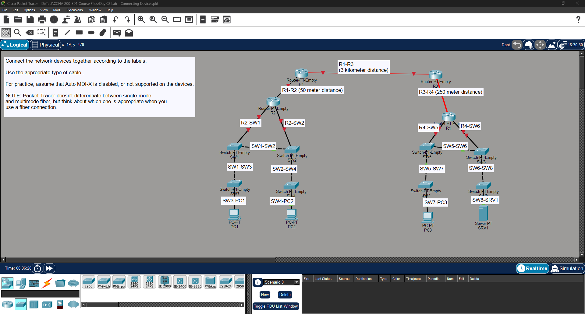

# 🧪 Lab 02 - Connecting Network Devices

## 🎯 Objective

Build the given network topology and connect all devices using the appropriate cable types based on the network requirements.

---

## 🛠️ Devices Used

- Cisco Routers
- Cisco Switches
- PCs
- Server

---

## 📌 Tasks Performed

- Connected routers, switches, PCs, and server.
- Selected the correct cable type for each connection.
- Used UTP and Fiber-Optic cables where required.
- Applied Straight-Through and Crossover cables based on device types.
- Considered Single-Mode and Multimode Fiber for different connection distances.

---

## 📖 Key Learning

- Identified the correct interfaces for connecting network devices.
- Understood when to use Straight-Through and Crossover cables.
- Learned the difference between UTP and Fiber-Optic cables.
- Understood the purpose of Single-Mode and Multimode Fiber.
- Practiced selecting the correct cable for different network devices.

---

## 📷 Screenshot

---

## ✅ Status

Completed
